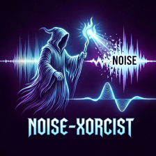

# noise-xorcist 
noise-xorcist is a unified single-channel speech enhancement toolbox, which incorporates a variety of traditional signal processing algorithms and modern deep learning-based methods. Notice: The code is still under development and some parts not yet ready for use.

## Singal processing
  
### noise estimitation  
- [√] minimum statistics algorithm 
- [√] MCRA algorithm
- [√] MCRA2 algorithm
- [√] IMCRA algorithm
- [√] Continuous minimal tracking algorithm
- [√] Weighted spectral average algorithm
- [√] Connected time-frequency regions algorithm
- [√] SPP algorithm

### spectral gain estimation
- [√] spectral substractive
- [√] MMSE
- [√] LogMMSE
- [√] LogMMSE SPU
- [√] STSA series
- [√] Wiener
- [√] Omlsa

## Deep learning

### network
- [√] NSNet
- [√] CRN
- [√] DPCRN
- [√] GCRN
- [√] GCCRN
- [√] GTCRN
- [√] DeepfilterNet series

### loss
- [√] WeightedSpeechDistortionLoss
- [√] ComplexCompressedMSELoss
- [√] NegativeSNRLoss
- [√] GainMaskBasedNegativeSNRLoss
- [√] STFTLoss
- [√] MultiResolutionSTFTLoss
- [√] SISNRLoss

## noisyspeech synthesizer
- [√] SpecAugment
- [√] MixAugment
- [√] VolAugment
- [√] ClipAugment
- [√] BreakAugment
- [√] HowlingAugment
