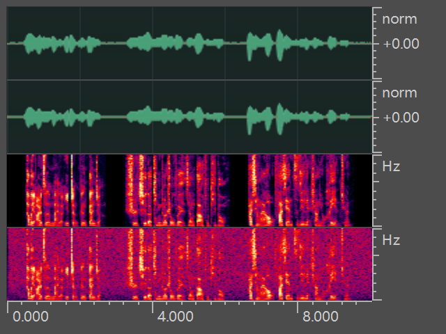
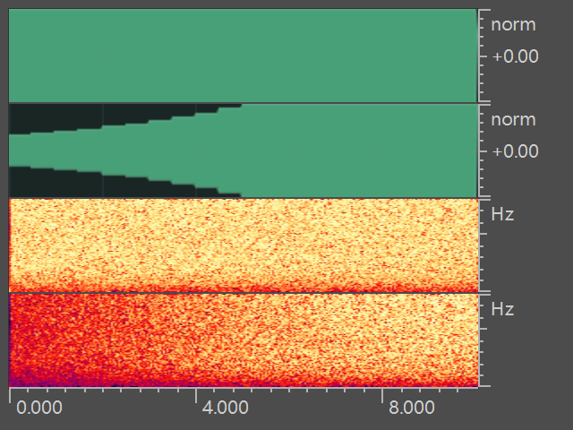
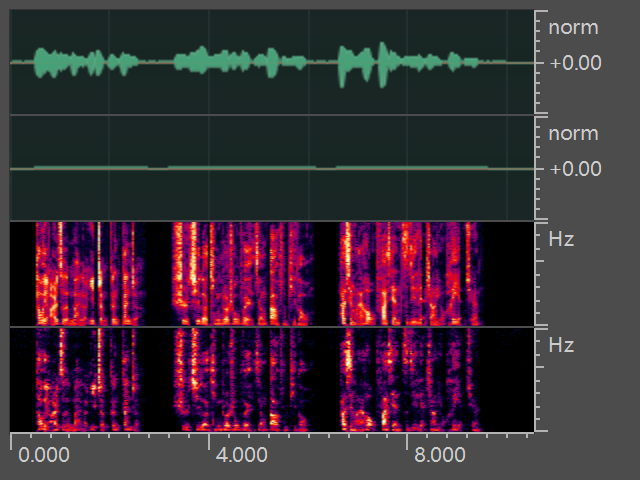

# Datasets
Generating training data for speech enhancement.

## How to run
1. Edit noisyspeech_synthesizer.cfg to include the paths to clean speech, noise directories and augmentation parameters. Also, specify the paths to the destination directories and store logs.
2. Just run `python noisyspeech_synthesizer_multiprocessing.py`

## Augmentations
The following augmentations are proposed in noise-xorcist: 
+ **SpecAugment** was proposed in [RNNoise](https://github.com/xiph/rnnoisehttps://github.com/xiph/rnnoise), which is achieved by filtering the noise and speech signal independently for each training example using a second order filter  

+ **MixAugment**
uses different snr combine speech samples and noise samples, which is a common method for data augment in speech enhencement  

+ **VolAugment**
apply step gains to target audio, which simulates different microphone volumes  

+ **ClipAugment**
truncate samples whose amplitude larger than a given level, which simulates clipping effect  

+ **ReverbAugment**
uses convolve to simulates reverberation. RIR datasets: [OpenSLR26](http://www.openslr.org/26/) and [OpenSLR28](http://www.openslr.org/28/)  

+ **BreakAugment**
use time-axis mask to simulates frame drop in communication  

+ **HowlingAugment**
use IR and feedback to generate howling effect  

